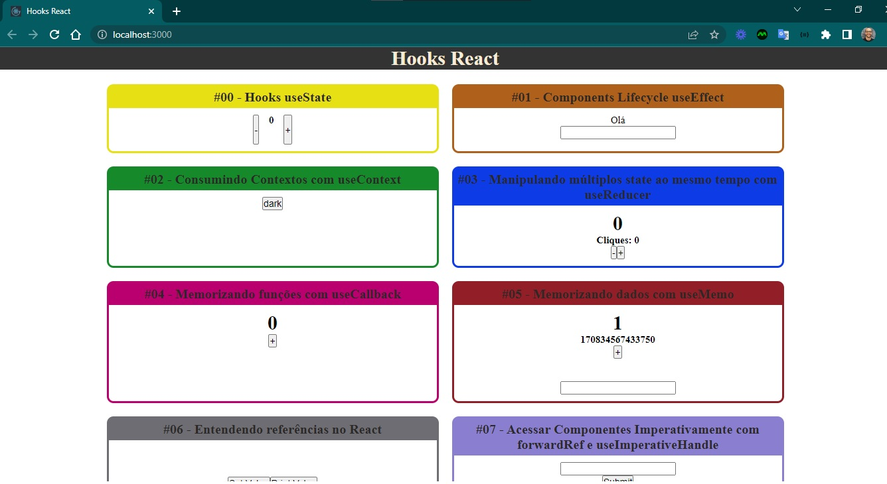

<h4 align="center"> 
	🚧 Hooks React 🚀
</h4>

  

 

## Sobre o projeto

- Criado um layout para expor na prática o conteúdo teórico de Hooks.

### Hooks React

- [x] useState #00: inicialização de estado
- [x] useEffect #01: está executando duas vezes. :. é como as coisas funcionam agora no React, a única maneira de desabilitar esse comportamento é desabilitar o modo estrito. Em create-react-app você pode ir no seu arquivo index.js e remover o componente de ordem superior StrictMode.
- [x] useContext #02: consumir contextos 
- [x] useReducer #03: manipular múltiplos state ao mesmo tempo 
- [x] useCallback #04: memorizando funções 
- [x] useMemo #05: memorizando dados 
- [x] useRef #06: entender referências 
- [x] forwardRef e useImperativeHandle #07: acessar componentes imperativamente 
- [x] useLayoutEffect #08: diferenças entre useEffect e useLayoutEffect 
- [x] useCustom #09: criar custom hook, criei o useFetch  
- [x] useDebugValue #10: para que serve esse hook

### Warnings

- [Por que o useEffect é executado duas vezes](https://josiaspereira.com.br/por-que-o-useeffect-e-executado-duas-vezes/)
- [posicionamento do header](https://www.w3schools.com/howto/howto_css_fixed_menu.asp)
- [posicionamento do footer](https://www.w3schools.com/howto/howto_css_fixed_footer.asp)

### Referências

Conteúdo do Mateus Silva
- [Instagram](https://www.instagram.com/imateus.silva/)
- [e-book React Hooks](https://devacademy.com.br/ebooks/react-hooks/)
- [playlist React Hooks](https://www.youtube.com/playlist?list=PLPXWI3llyMiLayGs4_noY8Q1-rbmbFoYM)
