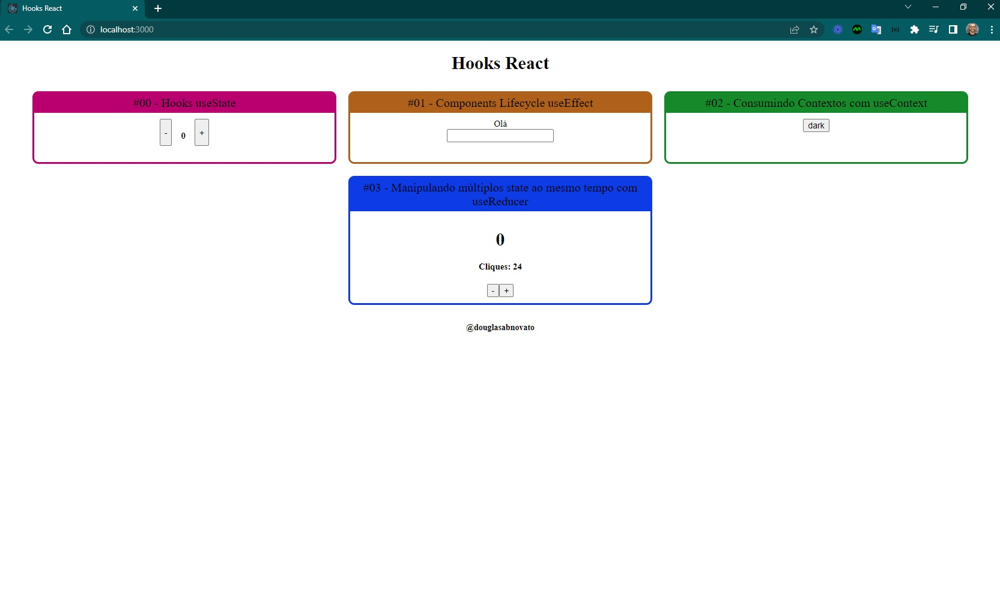

<h4 align="center"> 
	🚧 Hooks React 🚀
</h4>

  

 

## Sobre o projeto

- Criado um layout para expor na prática o conteúdo teórico de Hooks.

### Hooks React

- [x] useState #00
- [x] useEffect #01: está executando duas vezes. :. é como as coisas funcionam agora no React, a única maneira de desabilitar esse comportamento é desabilitar o modo estrito. Em create-react-app você pode ir no seu arquivo index.js e remover o componente de ordem superior StrictMode.
- [x] useContext #02: consumir contextos 
- [x] useReducer #03: manipular múltiplos state ao mesmo tempo 

### Referências

Conteúdo do Mateus Silva
- [Instagram](https://www.instagram.com/imateus.silva/)
- [e-book React Hooks](https://devacademy.com.br/ebooks/react-hooks/)
- [playlist React Hooks](https://www.youtube.com/playlist?list=PLPXWI3llyMiLayGs4_noY8Q1-rbmbFoYM)
